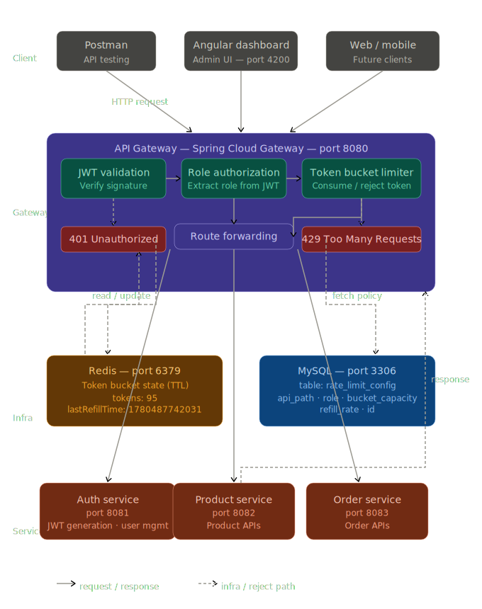

# API Rate Limiting Gateway


## Overview

API Rate Limiting Gateway is a microservices-based project built using Spring Boot, Spring Cloud Gateway, Redis, JWT Authentication, and MySQL.

The project acts as a centralized API Gateway that handles:

* JWT Authentication
* Role-Based Authorization
* Per User Rate Limiting
* Per Role Rate Limiting
* Per API Rate Limiting
* Dynamic Rate Limit Configuration
* Redis-Based Request Tracking
* Admin Management of Rate Limit Policies

The gateway sits between clients and backend microservices and ensures that requests are authenticated, authorized, and rate-limited before reaching downstream services.

---

## Architecture

### System Architecture



### Architecture Overview

The API Gateway acts as the central entry point for all client requests.

Responsibilities include:

- JWT Authentication & Validation
- Role-Based Authorization
- Token Bucket Rate Limiting
- Dynamic Policy Loading
- Request Routing

Redis stores token bucket state, while MySQL stores dynamic rate-limiting policies. The gateway validates requests before forwarding them to downstream microservices.

## Technologies Used

### Backend

* Java 21
* Spring Boot
* Spring Cloud Gateway
* Spring Security
* Spring Data JPA
* Spring WebFlux
* Lombok

### Database

* MySQL

### Cache & Distributed State

* Redis

### Authentication

* JWT (JSON Web Token)

### Containerization

* Docker

### Testing

* Postman

---

## Features

### JWT Authentication

Users authenticate using JWT tokens.

All protected APIs require a valid token before accessing backend services.

---

### Role-Based Authorization

Supported Roles:

* ADMIN
* MANAGER

Example:

ADMIN:

* Create Products
* Update Products
* Delete Products

MANAGER:

* Read Operations Only

---

### Redis-Based Rate Limiting

Rate limiting counters are stored in Redis.

Benefits:

* Fast lookups
* Distributed storage
* Scalable architecture

Example Redis Key:

rate_limit:user@gmail.com:GET:/api/products

---

### Token Bucket Rate Limiting

The gateway uses the Token Bucket Algorithm to control request traffic.

Each API and user combination maintains a bucket in Redis.

Bucket Configuration:

* Bucket Capacity
* Refill Rate

Example:

Capacity = 100 tokens

Refill Rate = 10 tokens/sec

Request Flow:

1. Request arrives
2. Bucket is loaded from Redis
3. Tokens are refilled based on elapsed time
4. One token is consumed
5. Request is allowed if tokens remain
6. HTTP 429 is returned if bucket is empty

Benefits:

* Handles traffic bursts
* Prevents API abuse
* Smooth request throttling
* Production-ready rate limiting strategy

### Per User Rate Limiting

Each user has an independent rate limit.

Example:

User A → 100 requests/minute

User B → 100 requests/minute

Counters are maintained separately.

---

### Per Role Rate Limiting

Different roles can have different limits.

Example:

ADMIN → 100 requests/minute

MANAGER → 50 requests/minute

---

### Per API Rate Limiting

Limits are maintained separately for each API.

Example:

GET /api/products

GET /api/orders

Each API has its own Redis counter.

---

### Dynamic Rate Limit Configuration

Rate limits are stored in MySQL.

Example:

| API Path      | Role    | Bucket Capacity | Refill Rate |
| ------------- | ------- | --------------- | ----------- |
| /api/products | ADMIN   | 100             | 10          |
| /api/products | MANAGER | 50              | 5           |
| /api/orders   | ADMIN   | 100             | 10          |
| /api/orders   | MANAGER | 50              | 5           |

Limits can be changed without modifying source code.

---

### Admin Rate Limit Management APIs

The gateway provides CRUD APIs for managing rate limits.

Examples:

GET /api/rate-limit

POST /api/rate-limit

PUT /api/rate-limit/{id}

DELETE /api/rate-limit/{id}

Only ADMIN users can access these APIs.

---

## Project Structure

```text
ApiGateway
│
├── filter
│     └── JwtAuthenticationFilter
│
├── ratelimit
│     ├── RateLimitFilter
│     ├── RateLimitService
│     ├── RedisConfig
│     │
│     ├── entity
│     │     └── RateLimitConfig
│     │
│     ├── repository
│     │     └── RateLimitRepository
│     │
│     ├── service
│     │     ├── RateLimitConfigService
│     │     └── RateLimitConfigServiceImpl
│     │
│     ├── controller
│     │     └── RateLimitController
│     │
│     └── dto
│           ├── RateLimitRequest
│           └── Response
│
├── util
│     └── JwtUtils
│
└── config
```

## Rate Limiting Flow

11. Client sends request.
2. API Gateway validates JWT.
3. User role is extracted.
4. Gateway loads Token Bucket policy from MySQL.
5. Bucket state is loaded from Redis.
6. Bucket is refilled based on elapsed time.
7. One token is consumed.
8. If no tokens remain, HTTP 429 is returned.
9. Otherwise request is forwarded to target service.
---

## Sample Response

HTTP 429 Too Many Requests

{
"message": "Rate Limit Exceeded"
}

---

## Future Enhancements

* IP-Based Rate Limiting
* Rate Limit Monitoring Dashboard
* Angular Admin UI
* Request Analytics
* Distributed Rate Limiting Across Multiple Gateway Instances

---

## Learning Outcomes

Through this project I learned:

* API Gateway Architecture
* Microservices Communication
* JWT Authentication
* Spring Cloud Gateway
* Redis Integration
* Dynamic Configuration Management
* Role-Based Access Control
* Distributed Rate Limiting Design
* Secure API Development
* Token Bucket Algorithm
* Redis-Based Distributed Rate Limiting
* API Traffic Throttling Strategies
